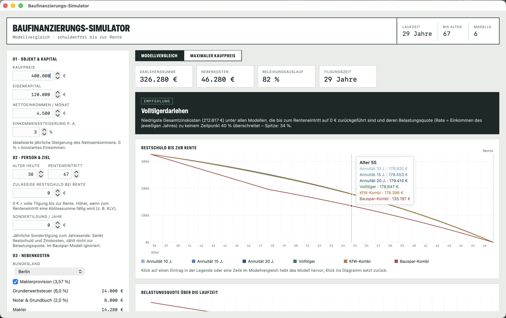
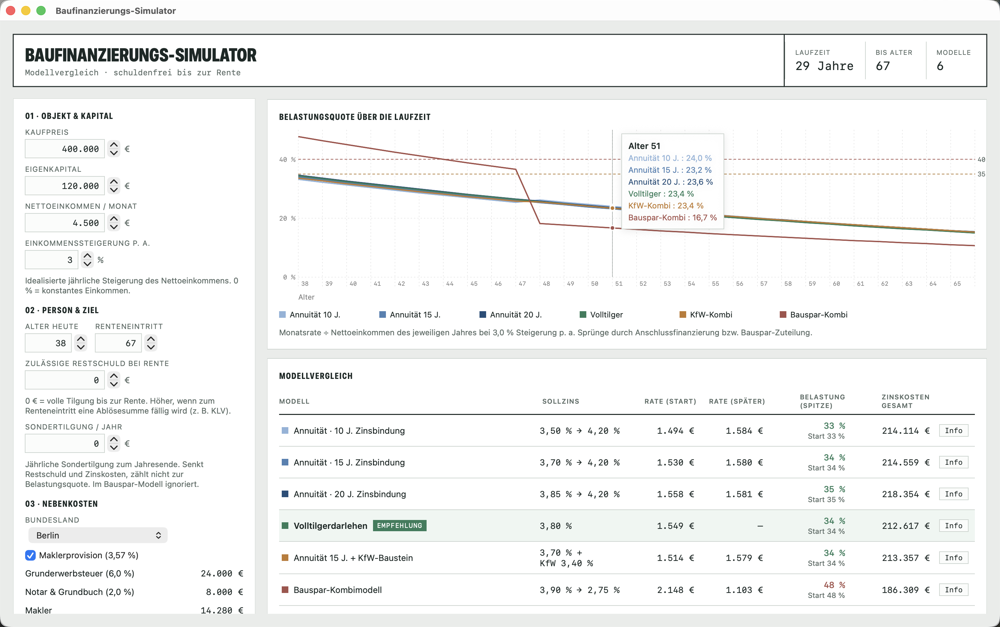
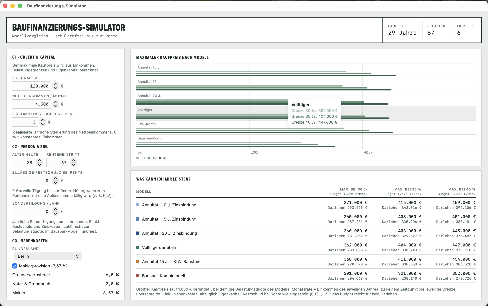

# BaufiSwift

Native macOS-App (SwiftUI) zum Vergleich von Baufinanzierungsmodellen – Port der
React-Web-App [`baufinanzierung-simulator`](https://github.com/saigyo/baufinanzierungs-simulator) mit
voller Funktionsparität. Ziel: Finanzierung ist zum Renteneintritt getilgt bzw.
auf eine definierte Ziel-Restschuld zurückgeführt (Ablösung z. B. durch eine
fällige Kapitallebensversicherung).

> [!WARNING]
> **Keine Finanz-, Anlage- oder Steuerberatung.** Diese App ist ein
> vereinfachtes Rechenmodell zu Bildungs- und Vergleichszwecken. Die Ergebnisse
> sind Schätzungen und können von realen Angeboten erheblich abweichen. Triff
> keine finanziellen Entscheidungen allein auf dieser Grundlage – ziehe eine
> qualifizierte, unabhängige Beratung hinzu. Nutzung auf eigenes Risiko, ohne
> Gewähr (siehe [Lizenz](#lizenz)).

## Features

- **Modellvergleich** von sechs Modellen: Annuität 10/15/20 J. (mit
  Anschlussfinanzierung), Volltilger, KfW-Kombi (≤ 100.000 €), Bauspar-Kombi.
- **Nebenkosten** automatisch je Bundesland (Grunderwerbsteuer, Notar/Grundbuch,
  optional Makler).
- **Belastungsquote** mit jährlicher Einkommenssteigerung (Spitze + Start,
  Schwellen 35/40 %), **Ziel-Restschuld bei Rente** + KLV-Beitrag.
- **Sondertilgung** (€/Jahr) und **Zins-Stresstest** (Aufschlag auf den
  Anschlusszins) als Zusatzspalte.
- **Umkehr-Modus**: maximaler Kaufpreis je Belastungsgrenze (Binärsuche).
- **Zwei Verlaufsdiagramme** (Restschuld, Belastungsquote) + Max-Kaufpreis-Balken,
  mit Fokus-Modus (Klick auf Legende oder Tabellenzeile).
- **Persistenz**: Auto-Speichern (UserDefaults) + Szenario-Teil-Code
  (Base64-JSON über die Zwischenablage, `⌘⇧C` / `⌘⇧V`).

## Screenshots

**Modellvergleich** – Empfehlung, Kennzahlen und Restschuldverlauf bis zur Rente
(mit Mouse-Over-Werten je Modell):



**Belastungsquote über die Laufzeit** und die vollständige Modell-Tabelle
(Sollzins, Rate Start/später, Belastungsspitze, Zinskosten):



**Umkehr-Modus** – maximaler Kaufpreis je Modell und Belastungsgrenze
(„Was kann ich mir leisten?"):



## Bauen & Starten

Voraussetzung: macOS 14+, Xcode 16+ / Swift 6.

```bash
swift build              # Debug-Build
swift run BaufiSwift     # App starten (Dock-Icon + Fenster via AppDelegate)
swift test               # Unit-Tests (Finanzmathematik + Persistenz)
```

In Xcode: `Package.swift` öffnen, Schema **BaufiSwift** wählen und ausführen (⌘R).

### Echtes App-Bundle

Ein SwiftPM-Executable ist nur ein nacktes Binary. Für eine doppelklickbare
native App mit Dock-Icon wird es in ein `.app`-Bundle mit `Info.plist` verpackt:

```bash
scripts/make-app.sh          # erzeugt ./BaufiSwift.app (Release, ad-hoc signiert, inkl. Icon)
open BaufiSwift.app          # starten – oder im Finder doppelklicken
```

### App-Icon

Das Icon (Bauplan-Stil: Haus + fallende Restschuld-Kurve) wird programmatisch
gezeichnet. Bei Änderungen neu generieren:

```bash
swift scripts/make-icon.swift                       # -> scripts/icon1024.png
# Iconset-Größen + .icns erzeugen:
mkdir -p scripts/AppIcon.iconset
for s in 16 32 128 256 512; do s2=$((s*2)); \
  sips -z $s $s   scripts/icon1024.png --out scripts/AppIcon.iconset/icon_${s}x${s}.png; \
  sips -z $s2 $s2 scripts/icon1024.png --out scripts/AppIcon.iconset/icon_${s}x${s}@2x.png; done
iconutil -c icns scripts/AppIcon.iconset -o scripts/AppIcon.icns
```

`make-app.sh` kopiert `scripts/AppIcon.icns` ins Bundle (`CFBundleIconFile`).

Beim Start über `swift run` setzt ein `AppDelegate` zusätzlich die
Activation-Policy auf `.regular`, damit auch das nackte Binary ein Dock-Icon
bekommt und das Fenster nach vorne kommt.

## Architektur

Logik und UI sind in getrennten Targets; **`BaufiCore` ist UI-frei** und direkt
testbar (analog zu `src/lib/` im Original):

- `Sources/BaufiCore/`
  - `Constants.swift` – Grunderwerbsteuer je Bundesland, Notar-Prozent.
  - `Formatting.swift` – `eur`/`pct` (de-DE), `typealias Cents = Int`.
  - `Finance.swift` – Finanzmathematik: `annuityPayment`, `annuLoan`, `addLoans`,
    `buildModels`, Modell-Zusammenfassung.
  - `Calc.swift` – `computeCalc` (Modellvergleich) und `computeInvers` (Umkehr-Modus).
  - `AppData.swift` – Eingabe-Datentypen und `Defaults`.
  - `Persistence.swift` – Auto-Speichern + Teil-Code (Codable, Base64).
- `Sources/BaufiSwift/` – SwiftUI: `BaufiSwiftApp` (Menü, Fenster), `AppState`
  (`@Observable`), `ContentView` (Orchestrator), `Views/` (InputPanel,
  ComparisonCharts, ModelTable, MaxPriceSection, Footer), `Controls`, `Theme`,
  `Components`.
- `Tests/BaufiCoreTests/` – aus dem Original portierte Invarianten-Tests.

## Geldrepräsentation (Festkomma)

Alle Geldbeträge werden intern als **`Int`-Cents** geführt (100 = 1,00 €), nicht
als `Double` – das vermeidet Float-Akkumulationsdrift über die hunderten
Monatsiterationen einer Finanzierung. Zinssätze/Quoten bleiben `Double` (Faktoren).
Der Monatszins wird je Periode auf den Cent gerundet und die Monatsrate je Phase
auf ganze Cents (wie eine Bank eine feste Rate stellt). Folge: Die Ziel-Restschuld
wird auf wenige Euro genau getroffen statt exakt – ein Cross-Check gegen das
JS-Original zeigt Abweichungen von ≤ 1 €. Die Invarianten-Tests verwenden
entsprechend eine Cent-Toleranz.

## Lizenz

[MIT](LICENSE) © 2026 Markus Ackermann. Die Software wird „wie besehen", ohne
jegliche Gewährleistung bereitgestellt. Vereinfachtes Rechenmodell (Details im
UI-Footer) – siehe den Haftungsausschluss oben.
